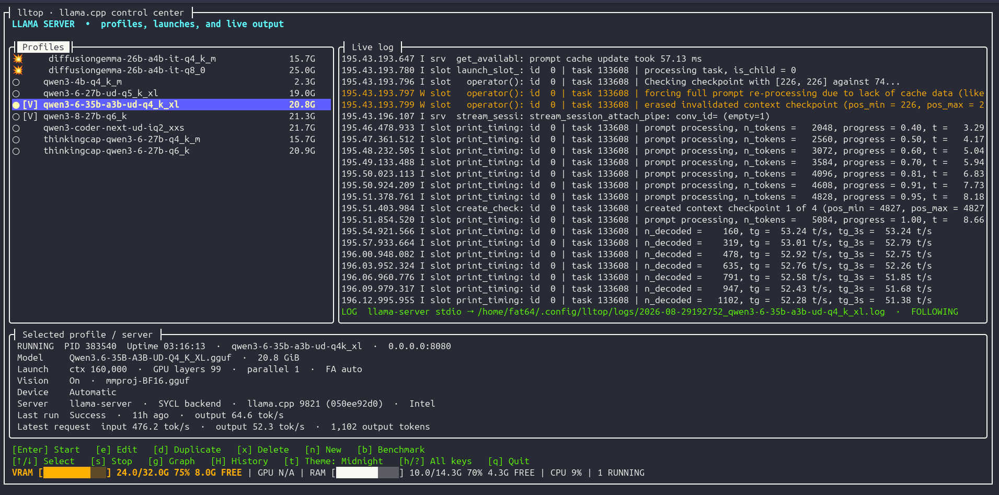

# lltop-dotnet




A .NET 10 + Terminal.Gui v2 control center for llama.cpp's `llama-server`.

## Current features

- Create, edit, duplicate, delete, validate, and reload TOML profiles in the TUI.
- Start a selected profile with argument-safe process invocation.
- Gracefully stop `llama-server` with `SIGINT` on Unix, escalating to a process-tree kill after a timeout.
- Force-kill a managed server when needed.
- Display live stdout/stderr, PID, uptime, bind address, model, and launch state.
- Parse and display throughput, progress, GPU offload, memory/context data, errors, and hints.
- Persist a timestamped log for each run.
- Persist JSON run history with per-profile performance summaries, sparklines, editable notes, and two-second resource samples.
- Press `g` on a selected profile to replace the runtime log with an ASCII graph of the latest run's VRAM and system-RAM use, including sampled peaks after a crash.
- Write a live, tab-separated `run-<datetime>-<profile>.dat` graph source beside run records. It includes resource samples plus structured llama.cpp cache, checkpoint, request, and idle events.
- Warn before repeating a recently failed startup configuration.
- Detect externally started `llama-server` processes and follow their logs when available.
- Copy launch commands, toggle log autoscroll, and inspect history from the keyboard.
- Configure the llama.cpp binary and model directory with a first-run wizard.
- Scan `.gguf` and `.bin` models after setup and generate profiles with Qwen, GPT-OSS, DeepSeek, or safe generic defaults.
- Enable Qwen3.6-35B-A3B and Qwen3.8-27B vision profiles with a matching `mmproj-BF16.gguf` projector.
- Discover sibling `mmproj*.gguf` files and use their GGUF metadata to suggest the matching vision projector.
- Exclude local models from discovery with glob patterns in `<models_dir>/.llmignore`.
- Run layered context, KV-cache, and math benchmarks with warmup, post-warmup VRAM sampling,
  OOM stop/continue handling, and standalone HTML/JSON reports.

Run with:

```sh
./checkreqs.sh
./build.sh
./launch.sh
```

`checkreqs.sh` verifies that Ubuntu has the .NET 10 SDK needed to build the app
and prints installation instructions when it is missing.

The main keys are shown in the application footer. Press `d` to duplicate the
selected profile, `H` for run history and notes, `g` for its resource graph, `c` to copy the launch command,
and `l` to toggle log autoscroll. Profiles
are stored under `~/.config/lltop/profiles` and run records under
`~/.config/lltop/runs` by default.

## Live graph viewer

Each managed run also creates an append-only `run-*.dat` file in `runs_dir`.
It can be read while the server is running. The included viewer uses Matplotlib's
native toolbar for pan and zoom, can filter metrics and event labels, and can
follow the live file:

```sh
python3 -m pip install matplotlib
python3 tools/realtime_graph.py ~/.config/lltop/runs/run-20260826-120000-qwen.dat --follow
```

For example, show only VRAM and GPU use while annotating idle and error events:

```sh
python3 tools/realtime_graph.py run-*.dat --metrics vram,gpu --events slots_idle,error
```

The `.dat` format is tab-separated and has `sample`, `event`, and `telemetry`
rows sharing UTC timestamps. Event rows carry an `event` name, JSON object of
parsed fields, and the raw llama.cpp line. This preserves events such as
`prompt_cache_evict`, `checkpoint_create`, `checkpoint_erase`,
`full_prompt_reprocess`, `request_start`, `request_end`, and `slots_idle` for
external plotting without depending on one llama.cpp log format.

## Benchmark sweeps

Select a profile and press `b` to configure a benchmark. The server must be
idle: lltop refuses to start a benchmark while a managed or externally detected
`llama-server` is active. Set a context start, stop, and number of steps; steps
include both endpoints. The selected profile is the reference configuration,
not a benchmark case, and a context point that exactly matches it is skipped.

After the context sweep, inspect the results and choose a completed context
case to continue. lltop then runs a KV-cache layer at that chosen context using
`q4_0/q4_0`, `q8_0/q8_0`, `f16/f16`, `iq4_nl/iq4_nl`, and `q4_0/q8_0` cache
K/V combinations. Each cache case also runs a three-question, deterministic
multi-step arithmetic suite; the terminal and HTML report show its score (for
example, `3/3`) beside VRAM headroom.

The configured prompt is the global warmup workload for every case. lltop waits
up to 300 seconds for readiness, then samples available VRAM once per second for
10 seconds after warmup. Press `B` to cancel; lltop stops the benchmark-owned
server and records cancellation. OOM outcomes can stop the remaining cases or
continue, as chosen in setup. Benchmark executions are not added to normal run
history. Each layer produces JSON and self-contained HTML reports in
`benchmarks_dir` (`~/.config/lltop/benchmarks` by default).

## Theme

lltop ships with the `midnight` (default) and `nord` themes. Press `t` in the
main window to cycle between them; the choice is saved to configuration. You can
also set `theme = "midnight"` or `theme = "nord"` in
`~/.config/lltop/config.toml`. Themes use semantic
tokens for selection, hotkeys, warnings, errors, and memory-fit states, so
future palettes can change the appearance without changing the meaning of
`FULLY ON GPU`, `TIGHT`, or `PARTIAL OFFLOAD REQUIRED`.

Model discovery reads an optional `.llmignore` from the configured models directory.
Blank lines and `#` comments are ignored; `*`, `?`, `**`, directory patterns, and
later `!` negation rules are supported. For example:

```gitignore
archive/
experiments/**/*.gguf
mmproj*.gguf
!vision/mmproj-BF16.gguf
```

Verify changes with:

```sh
dotnet build lltop/lltop.csproj --no-restore
dotnet test tests/lltop.Tests/lltop.Tests.csproj --no-restore
```

## Model catalog refresh

`./refresh_models.sh` builds a small local SQLite catalog from Hugging Face,
the Ollama Library, ModelScope, or all three. It asks which source to use and
stores its cache under `~/.local/share/lltop/model-catalog.sqlite` by default
(override with `XDG_DATA_HOME` or pass `--db PATH`). The catalog is optional
and is not used to launch models yet. See [USER_CATALOG_TEST.md](USER_CATALOG_TEST.md)
for a quick user test. View the cached catalog with `./catalog.sh ollama` or
search every source with `./catalog.sh --search qwen`. Add `--sort family` or
`--sort size` to arrange the results.

Refreshes are deliberately bounded: Hugging Face imports at most 100 models,
ModelScope at most 50, and Ollama at most 100 families with 12 listed variants
per family. Pass `--limit N` (1–100) to lower the Hugging Face/Ollama bound.

### Refresh behavior and network use

Catalog refresh is user-triggered; lltop does not poll sources or refresh at
application startup. Each successfully refreshed source is reused for seven
days. Run `./refresh_models.sh --force` when you intentionally want current
data sooner. A failed refresh preserves the last successful cache and makes no
automatic retry. The importer identifies itself with a stable `User-Agent`,
uses the Hugging Face and ModelScope APIs where available, and keeps requests
sequential. Sources can still rate-limit or change their response formats, so
the catalog is always optional and best-effort.

For a specific upstream Hugging Face model, fetch and cache only its three most
downloaded linked GGUF quantization repositories with:

```sh
./catalog.sh --quantizations Qwen/Qwen2.5-7B-Instruct
```

Use `--refresh` to query Hugging Face again, or `--top N` to cache more than
the default three repositories (for an existing cached result, combine them as
`--refresh --top N`). Quantization lookups are capped at 10 repositories.
